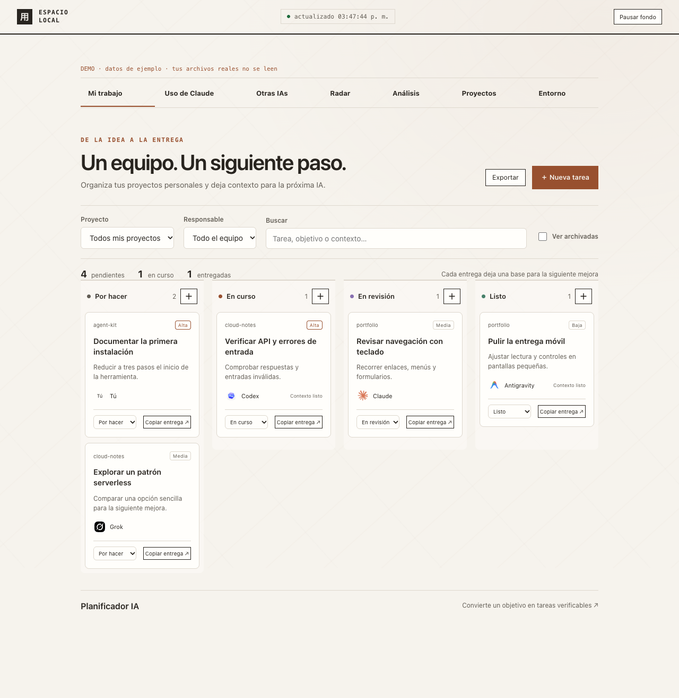
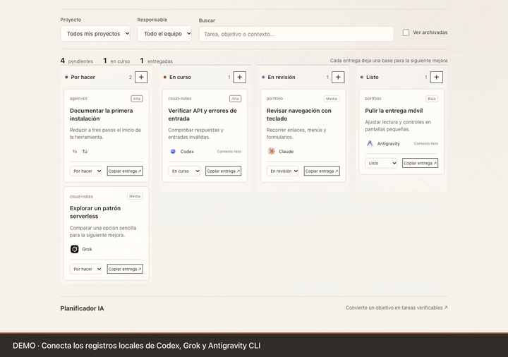

# Espacio local

Tu uso de IA, tus proyectos y tu siguiente tarea, en una sola herramienta local.



Espacio local reúne registros de **Claude Code, Codex, Grok y Antigravity CLI**, un kanban compartido entre agentes y un Radar de arquitecturas, aprendizaje, créditos AWS y oportunidades laborales. Corre en tu equipo con Node.js. Sin cuenta del dashboard, dependencias de servidor ni compilación.

**[Ver el video de uso · 1 minuto](https://github.com/DavidRm1911/claude-dashboard/blob/main/docs/media/uso.mp4)** · [Guía paso a paso](docs/USAGE.md) · [English quick start](docs/README.en.md)

[](https://github.com/DavidRm1911/claude-dashboard/releases/download/v1.4.0/espacio-local-uso.mp4)

Versión inicial pública **1.4.0**. Herramienta independiente; los nombres y logos de las IAs identifican sus fuentes y pertenecen a sus propietarios.

## Empieza en tres pasos

Necesitas **Node.js 22 o superior** y Git. macOS es la plataforma probada con registros reales; la suite también se configura para Linux. Los formatos locales de cada agente pueden cambiar. Windows todavía no tiene verificación completa.

```sh
git clone https://github.com/DavidRm1911/claude-dashboard.git
cd claude-dashboard
npm start
```

Abre **http://127.0.0.1:4949**. No necesitas `npm install`: el servidor no tiene dependencias externas. No necesitas claves API para consultar registros o usar el tablero.

¿Quieres verlo primero sin conectar nada?

```sh
npm run demo
```

Abre **http://127.0.0.1:4950**. La demo crea proyectos, registros y tareas sintéticos en una carpeta temporal; no lee tu historial real. Las llamadas IA y la actualización de fuentes están desactivadas en ese modo. El video y las capturas usan esta demo.

## Qué puedes hacer

| Espacio | Para qué sirve |
| --- | --- |
| Mi trabajo | Tareas por proyecto y agente, prioridades, criterios de aceptación, contexto de entrega, archivo recuperable y exportación |
| Uso de Claude | Tokens, caché, sesiones, modelos y equivalente de precio API |
| Otras IAs | Actividad y datos verificables de Codex, Grok y Antigravity CLI |
| Radar | Fuentes AWS, recursos y créditos condicionados, empleo Perú/LATAM/global y compatibilidad técnica con tu CV |
| Proyectos | Documentación local, mejoras e ideas; generación IA opcional |
| Entorno | Skills, configuración MCP detectada y herramientas locales |

Un costo de referencia **no es tu factura de suscripción**. `N/D` significa que falta información verificable. Antigravity CLI aporta actividad; no se inventan tokens ni costos. La compatibilidad del CV compara términos técnicos y no predice una contratación.

## Conecta tus agentes

Claude Code se detecta en los perfiles locales habituales. En **Tus agentes**, pulsa **Agregar Codex**, **Agregar Grok** o **Agregar AGY**. Instala y autentica cada herramienta por sus instrucciones oficiales antes de intentar generadores; conectar registros no inicia una sesión ni cambia su autenticación.

| Fuente | Ubicación habitual | Cobertura |
| --- | --- | --- |
| Claude Code | `~/.claude/projects`, `~/.claude-work/projects`, `~/.claude-personal/projects` | Uso, caché, sesiones y replay |
| Codex | `~/.codex/sessions/**/rollout-*.jsonl` | Tokens por modelo y cuotas cuando el registro las incluye |
| Grok CLI | `~/.grok/sessions/**/{summary,usage}.json` | Turnos y costo registrado cuando existe |
| Antigravity CLI | `~/.gemini/antigravity-cli/brain/*/.system_generated/logs/transcript*.jsonl` | Sesiones, mensajes y herramientas |

Las sesiones cloud que no dejen registros locales y Antigravity IDE no están cubiertos. [Detalles y solución de problemas](docs/USAGE.md#conectar-y-comprobar-registros).

## Trabaja con varias IAs

1. Abre **Mi trabajo**, crea una tarea y selecciona un proyecto personal.
2. Asigna responsable, objetivo y criterios de aceptación.
3. Mueve la tarea por **Por hacer → En curso → En revisión → Listo**, arrastrando o usando el selector.
4. Usa **Copiar entrega** para continuar en tu IA. Incluye ID, versión, criterios, contexto y cómo actualizar la API local.
5. Deja archivos cambiados, pruebas y bloqueos en el contexto para la siguiente sesión.

Asignar una IA identifica al responsable; no la ejecuta automáticamente. Las versiones de tarea impiden que dos agentes sobrescriban avances simultáneos. [Protocolo y ejemplos para agentes](docs/AGENT-WORKFLOW.md).

El **Planificador IA** usa tu Claude CLI para convertir un objetivo en propuestas verificables. El botón envía el objetivo y hasta 30 títulos/estados del proyecto elegido; revisas las propuestas antes de incorporarlas. No dispone de herramientas ni MCP y no modifica repositorios. Requiere una sesión Claude válida y puede consumir tu cuota. La integración se prueba con respuestas simuladas; el comportamiento autenticado depende de tu instalación.

## Radar y CV

Pulsa **Activar Radar** para consultar feeds públicos de AWS/Builder Center y empleo Remotive/Get on Board. Las fuentes reciben solicitudes desde tu equipo; no reciben tu CV, proyectos ni historial. La búsqueda manual de créditos usa AWS Knowledge MCP con una consulta genérica fija.

Los créditos AWS dependen de cuenta, programa y vigencia; el panel muestra condiciones y enlaces oficiales. **No garantiza que seas elegible**. Revisa la publicación original antes de inscribirte o postular.

En **Empleo**, pega tu CV o importa TXT/MD/PDF para ordenar vacantes por coincidencias técnicas. El CV se guarda en ese navegador. Extraer PDF requiere `pdftotext` instalado; si no lo tienes, pega el texto. La extracción ocurre en localhost y no envía el documento a una IA. [Guía del Radar](docs/USAGE.md#radar-y-empleo).

## Configura tu instalación

El directorio personal por defecto es `~/dev/GitHub`; el de trabajo, `~/dev/Work`. Cambia las rutas si tus proyectos están en otro sitio:

```sh
cp .env.example .env.local
# Edita .env.local con tus rutas y preferencias.
npm run start:config
```

`npm start` no carga `.env.local`; usa `start:config` cuando quieras ese archivo.

| Variable | Valor por defecto |
| --- | --- |
| `PORT` | `4949` |
| `DASHBOARD_PROJECTS_DIR` | `~/dev/GitHub` |
| `DASHBOARD_WORK_DIR` | `~/dev/Work` |
| `DASHBOARD_DATA_DIR` | `~/.claude-dashboard` |
| `DASHBOARD_VAULT_DIR` | `~/Documents/obsidian-vault` |
| `DASHBOARD_ENABLE_AI` | `0`: generadores de ideas/análisis/entrevista desactivados |
| `DASHBOARD_ENABLE_GIT_WRITE` | `0`: Git push desactivado |

Para habilitar ideas, análisis y entrevistas, configura `DASHBOARD_ENABLE_AI=1` y reinicia. Esas funciones pueden enviar documentación del proyecto y notas al proveedor. El planificador tiene su botón de envío específico. El dashboard público no incluye preferencias de otra instalación.

## Datos y límites

- El servidor escucha en **127.0.0.1**. Está diseñado para una persona en su equipo; no es un SaaS ni un servicio para exponer con túneles.
- Preferencias, tablero y cachés viven fuera del repo. Exportar el tablero descarga una copia JSON; el CV vive en `localStorage` del navegador.
- Historial y replay pueden contener conversaciones privadas. Revisa cualquier captura antes de compartirla.
- Los precios son referencias fechadas, con cobertura explícita. No se atribuyen tarifas a modelos desconocidos ni se prometen cuotas actuales a partir de un snapshot viejo.
- La app no realiza telemetría. Radar y generadores hacen conexiones externas al activarlos.

## Desarrollo y contribuciones

```sh
npm test
node --check server.js
```

50 pruebas de regresión cubren contabilidad, parsers, seguridad, Radar y coordinación de tareas. Revisión adicional con Chrome: teclado, persistencia, arrastre, modo oscuro y movimiento reducido en cuatro anchos. [Cómo contribuir](CONTRIBUTING.md) · [Seguridad](SECURITY.md) · [Arquitectura y límites](docs/DEVELOPMENT.md).

Código bajo [MIT](LICENSE). Chart.js y los logos conservan sus licencias y atribuciones en [THIRD_PARTY_NOTICES.md](THIRD_PARTY_NOTICES.md). Creado por [David Gallo](https://github.com/DavidRm1911).
